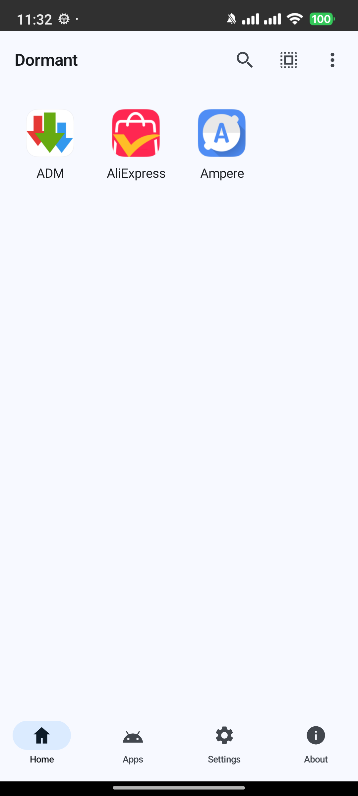
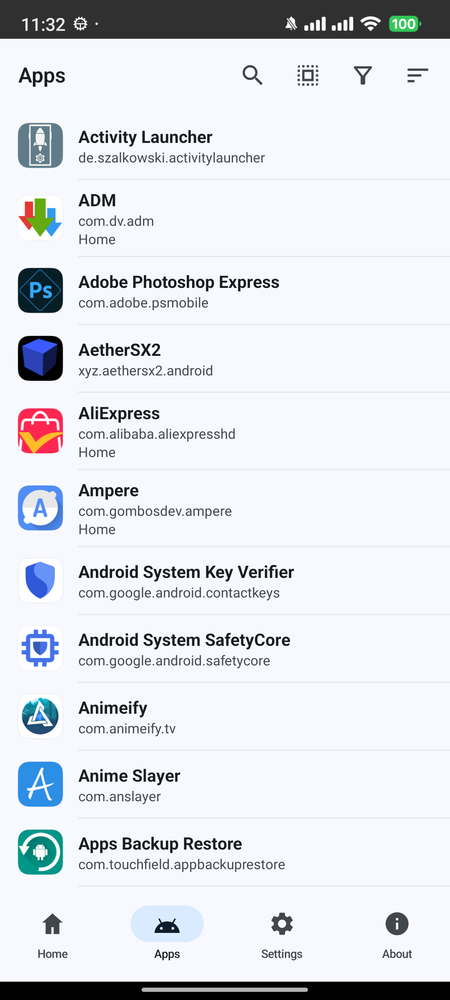
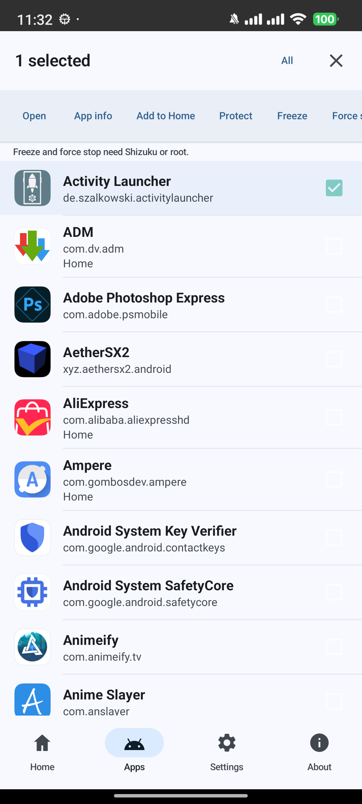

# Dormant Releases

This repository hosts public signed APK releases for **Dormant**.

Dormant is an Android app manager focused on freezing, force-stopping, protecting, and organizing apps from one place.

## Screenshots

Click any screenshot to open it full size.

  
  
  

  
  

## Download

Current public release:

- Version: `1.0.0`
- Direct APK: [app-release.apk](https://github.com/ilyassbourass/Dormant-Releases/releases/download/v1.0.0/app-release.apk)
- Release page: [Dormant v1.0.0](https://github.com/ilyassbourass/Dormant-Releases/releases/tag/v1.0.0)

1. Open the [Releases](https://github.com/ilyassbourass/Dormant-Releases/releases) page.
2. Download the latest `app-release.apk`.
3. If Android asks, allow installation from your browser or files app.

## Update

Install the newer `app-release.apk` over your existing Dormant install.

- Package: `com.bourass.dormant`
- Signing key stays the same across official releases
- `versionCode` increases for upgrade compatibility

## Verify the APK

Each GitHub Release includes a SHA-256 checksum in the release notes.

You can compare the downloaded file hash with the release note hash before installing.

## Source code

Dormant source code is private. This repository is for public APK downloads only.

## Support

For support or release-related contact:

- `ilyassbourass2012@gmail.com`
